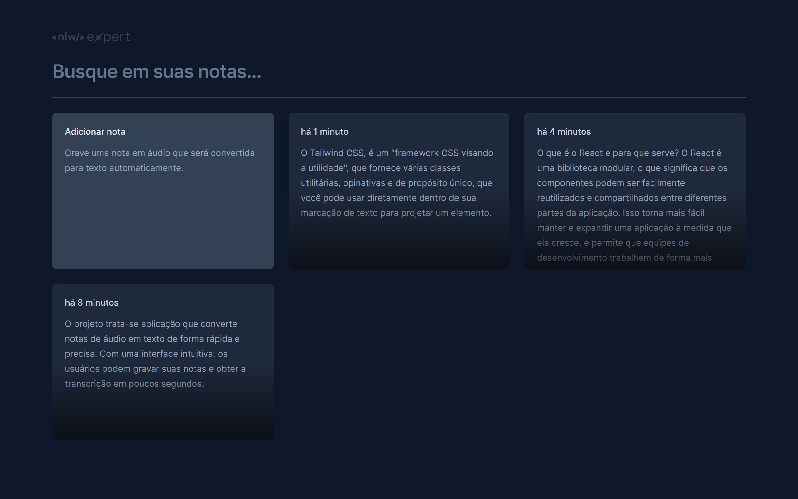

# NLW Expert (React)

Essa aplicação foi desenvolvida durante o NLW Experts da Rocketseat utilizando React, TypeScript, Tailwind e a SpeechRecognition API. 

## Table of contents

- [Visão geral](#visão-geral)
  - [Projeto](#projeto)
  - [Screenshot](#screenshot)
  - [Links](#links)
- [Meu processo](#meu-processo)
  - [Desenvolvido com](#desenvolvido-com)

## Visão geral

### Projeto

trata-se aplicação que converte notas de áudio em texto de forma rápida e precisa. Com uma interface intuitiva, os usuários podem gravar suas notas e obter a transcrição em poucos segundos.

### Screenshot

### Links

- Live Site URL: [Veja minha solução rodando](https://nlw-experts-notes-omega.vercel.app/)

## Meu processo

### Desenvolvido com

  - React
  - Date-fns
  - Tailwind CSS
  - TypeScript
  - Vite
  - PostCSS
  - Radix UI
  - Lucide-react
  - Sonner
  - SpeechRecognition

